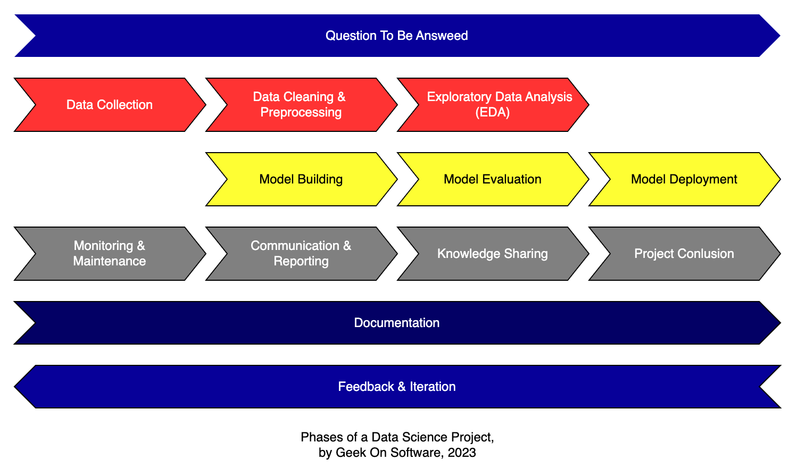
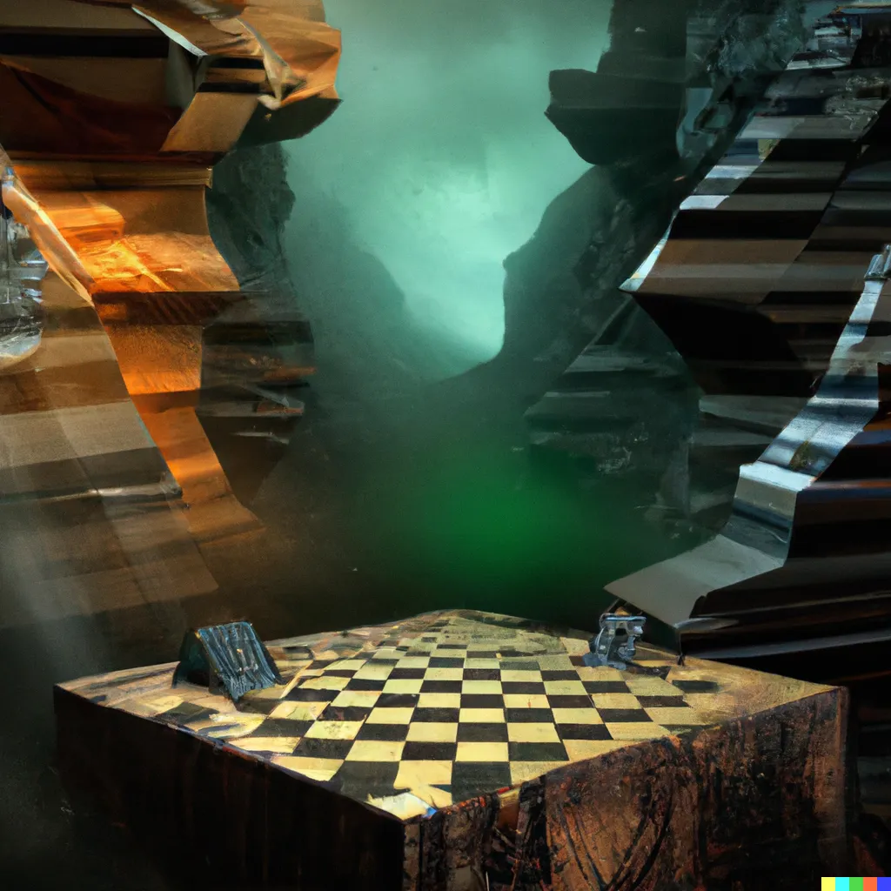
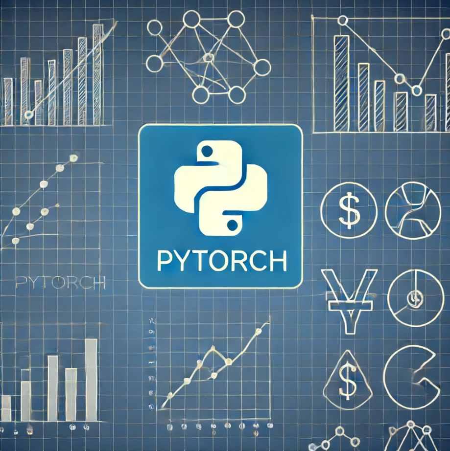

# Repository Name

Welcome to the `medium-py` repository!

This repository contains the source code for various apps and code
discussed in articles published on Medium.

Below is a list of articles and their corresponding source code (if applicable).

## Articles

|                                                                                 | Title                                                                                                                                                                                                                       | Links                                                                                                                                                                                                                                                                                     |
|---------------------------------------------------------------------------------|-----------------------------------------------------------------------------------------------------------------------------------------------------------------------------------------------------------------------------|-------------------------------------------------------------------------------------------------------------------------------------------------------------------------------------------------------------------------------------------------------------------------------------------|
|      | [Start Your Data Science Journey in Seconds with This CLI Template](https://medium.com/@geeks.sw.gig/start-your-data-science-journey-in-seconds-with-this-cli-template-9d97273f15c5)                                        | [Check On Medium ](https://medium.com/@geeks.sw.gig/start-your-data-science-journey-in-seconds-with-this-cli-template-9d97273f15c5), [cli-template-py repo](https://github.com/vBarbaros/cli-template-py), [source-code (current repo)](cli-datascience-intro)                            |
|  | [Mastering CliffWalking: Navigating the Environment with Clarity and Clean Code](https://medium.com/practical-coders-chronicles/mastering-cliffwalking-navigating-the-environment-with-clarity-and-clean-code-35faceb5cd73) | [Check On Medium ](https://medium.com/practical-coders-chronicles/mastering-cliffwalking-navigating-the-environment-with-clarity-and-clean-code-35faceb5cd73), [Jupyter Notebook](https://github.com/vBarbaros/medium-py/blob/main/cliffwalking-env/cliffwalking-clear-demo-medium.ipynb) |

## Leap of Faith Series

| PyTorch                                                                          | Title                                                                                                                                                                                      | Links                                                                                                                                                                                    |
|----------------------------------------------------------------------------------|--------------------------------------------------------------------------------------------------------------------------------------------------------------------------------------------|------------------------------------------------------------------------------------------------------------------------------------------------------------------------------------------|
|  | [Leap of Faith in PyTorch: Introduction (Day 1)](https://medium.com/@geeks.sw.gig/https://medium.com/practical-coders-chronicles/leap-of-faith-in-pytorch-introduction-day-1-ce9047352cf1) | [Check On Medium ](https://medium.com/practical-coders-chronicles/leap-of-faith-in-pytorch-introduction-day-1-ce9047352cf1), [source-code (current repo)](leap-of-faith-in-pytorch)      |
|  | [Leap of Faith in PyTorch: Tensor Operations (Day 2)](https://medium.com/practical-coders-chronicles/leap-of-faith-in-pytorch-tensor-operations-day-2-d4ff1ae12b51)                        | [Check On Medium ](https://medium.com/practical-coders-chronicles/leap-of-faith-in-pytorch-tensor-operations-day-2-d4ff1ae12b51), [source-code (current repo)](leap-of-faith-in-pytorch) |
